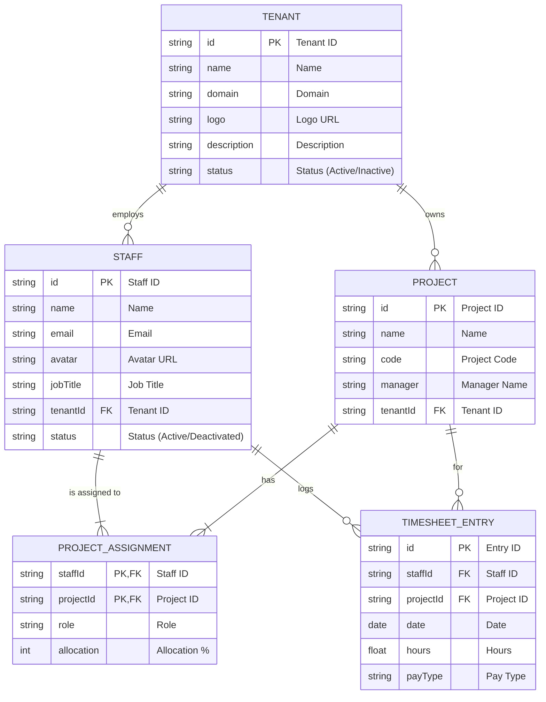

### Explanation of Relationships:

*   **TENANT** to **STAFF**: A `TENANT` can employ one or more `STAFF` members. (One-to-Many)
*   **TENANT** to **PROJECT**: A `TENANT` can own one or more `PROJECTS`. (One-to-Many)
*   **STAFF** to **PROJECT**: This is a many-to-many relationship, managed through the `PROJECT_ASSIGNMENT` entity.
    *   A `STAFF` member can be assigned to multiple `PROJECTS`.
    *   A `PROJECT` can have multiple `STAFF` members.
    *   The `PROJECT_ASSIGNMENT` entity holds details specific to that assignment, such as the staff member's `role` and `allocation` percentage.
*   **STAFF** and **PROJECT** to **TIMESHEET_ENTRY**:
    *   A `STAFF` member logs multiple `TIMESHEET_ENTRY` records.
    *   Each `TIMESHEET_ENTRY` is associated with a specific `PROJECT`.